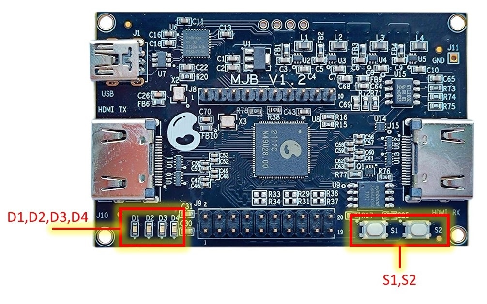

# MJB GRC AI Module User Guide  

## In the Box 

### MJB Development Board 

### MJB Accelerometer 

Connect the accelerometer to Dev Board.

Connect power.

## GRC AI SW Module  

A pre-installed demo applications set to highlight **On-Device-Learning and Classification**: 
* **Hand gestures**
* **Rhythm patterns**

## Operations

### Reset
Put the battery in or press S1+S2 > 2 sec.
**LED1-8** are blinking one by one	

### Ready
**D1-4** are green.
**LED1-8** shows already learned classes.

### Learning 
Press and hold **S1**, make a gesture or tap a rhythm, then release the button:
**D1-2** are blinking. 
**LED1-8** shows already learned classes. 
**LEDn** is associated with the gesture or rhythm you're learning.

### Classification 
Press and hold **S2**, make a gesture or tap a rhythm, then release the button: 
 		**D3-4** are blinking  
 	**LED1-8** shows the recognized class.
**LED1-8** blinks 3 times in case if nothing was recognized

### To clear all Learning classes
Press and hold **S1** and **S2** for more than 2 sec:
**LED1-8** indicates the process. **D1** light is on when deletion is completed.

### To clear the last Learning class 
Press **S1** twice and hold:
**LED1-8** blinking indicates the class being deleted.   
Then the board switches to the Learning mode

### Step 1. Introduction
Get familiar with buttons, LEDs, operations and sequence of actions.
We recommend that you first practice with simple gestures, for example, Up-Down, Left-Right.

### Step 2. Let's go
Go further with more complicated gestures or rhythms patterns.

**Tips**: To guarantee proper and successful recognition of hand gestures or rhythm patterns reproduce them as accurately as possible. 

