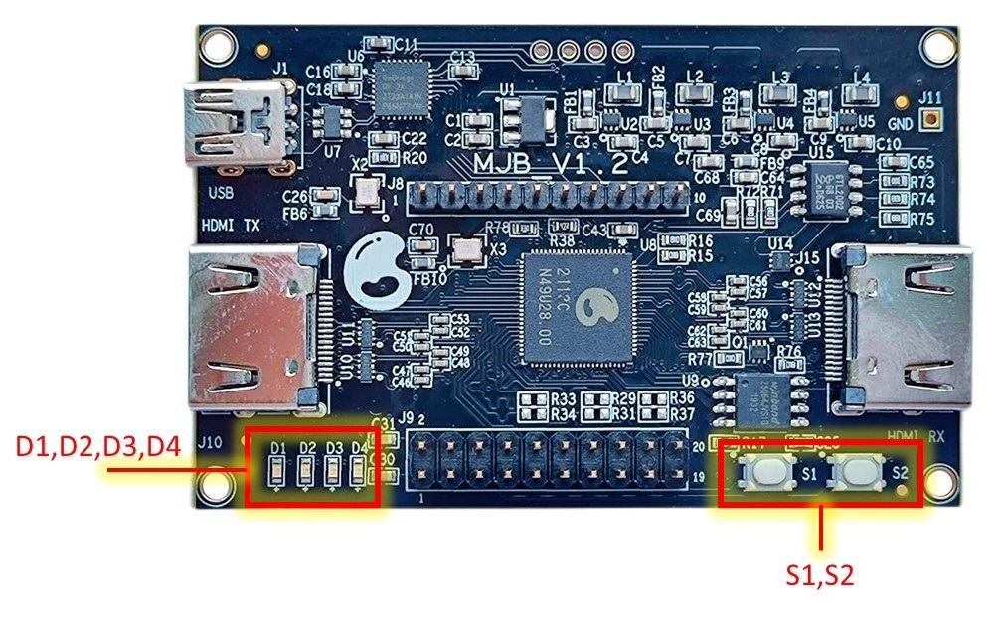

# MJB GRC AI Module User Guide  

## In the Box 

### MJB Development Board 

### MJB Accelerometer 

Connect the accelerometer to Dev Board.

Connect power.

## GRC AI SW Module  

Pre-installed demo applications for Training and Classification on-device:  
* **Hand gestures**
* **Rhythm patterns**

## Operations

### Reset
Put the battery in or press **S1**+**S2** > 2 sec.

**LED1-8** are blinking

### Ready
**D1-4** are green.

**LED1-8** shows learned classes.

### Learning 
Press and hold **S1**, make a gesture or tap a rhythm, then release:

**D1-2** are blinking. 

**LED1-8** shows learned classes. 

**LEDn** is associated with the gesture or rhythm you're learning.

### Classification 
Press and hold **S2**, make a gesture or tap a rhythm, then release: 

**D3-4** are blinking  
   
**LED1-8** shows the recognized class.
  
**LED1-8** blinks 3 times if nothing is recognized

### To clear all Learning classes
Press and hold **S1** and **S2** > 2 sec:

**LED1-8** indicates the process. **D1** is on when completed.

### To clear the Learning class 
Press **S1** twice and hold:

**LED1-8** is blinking the **last** class being deleted.   

### Step 1. Introduction
Get familiar with buttons, LEDs, operations, and sequence of actions.
We recommend first practice with simple gestures Up-Down, Left-Right.

### Step 2. Let's go
Go further with more complicated patterns.

**Tips**: To guarantee successful recognition reproduce patterns accurately. 

